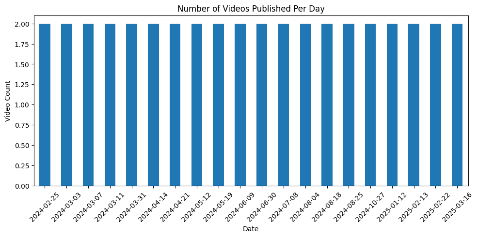
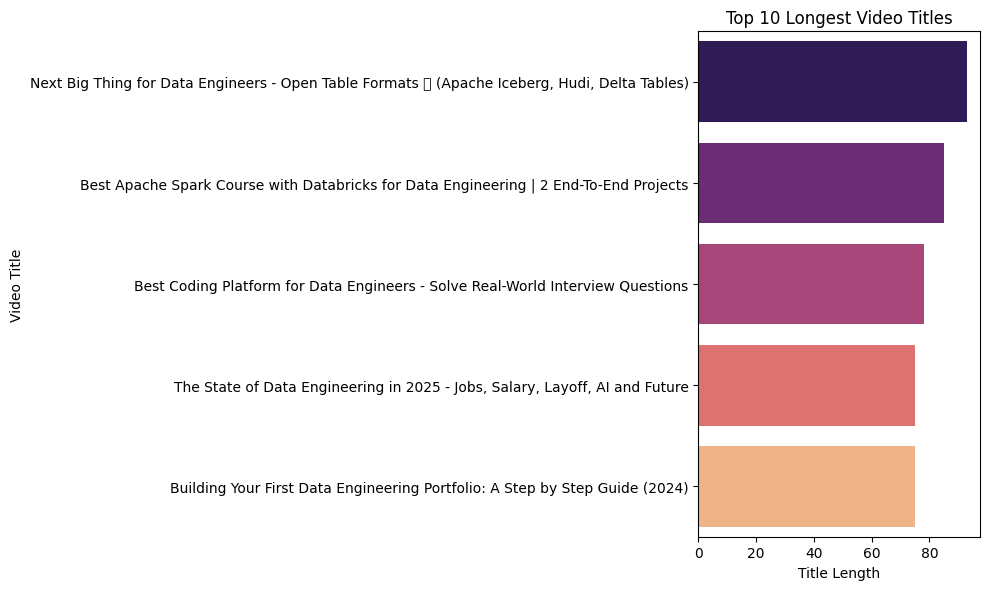
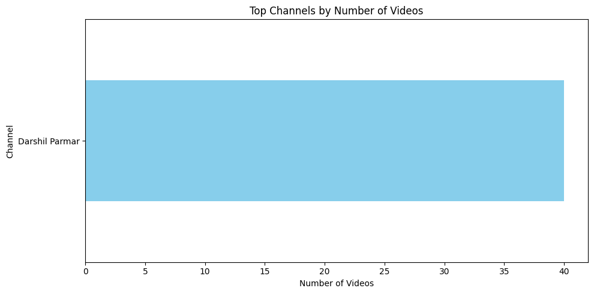

# 📊 YouTube Video Analytics Pipeline

This project builds a data engineering pipeline to collect, clean, store, and visualize YouTube video data using only local tools (no cloud platforms).

## 🚀 Features

- Fetches video metadata using YouTube Data API
- Stores raw JSON and cleaned CSV data
- Loads data into SQLite database
- Visualizes insights using Matplotlib & Seaborn

## 🧩 Tech Stack

- Python
- SQLite
- pandas
- matplotlib / seaborn
- YouTube Data API

## 📁 Folder Structure


## 📌 How to Run

1. **Install Dependencies**  
   ```bash
   pip install -r requirements.txt

2. **Run Scripts in Order**
```bash   
python fetch_youtube_data.py
python clean_youtube_data.py
python store_cleaned_data.py
python visualize_youtube_data.py
```

## 🔍 Example Visualizations

Here are some of the visual insights generated in this project:

- 📅 **Videos Published Over Time**  
  Bar chart showing how many videos were published each day.  
  

- 🔠 **Top 10 Longest Video Titles**  
  Bar chart of videos with the longest titles.  
  

- 🎬 **Top Channels by Number of Videos**  
  Horizontal bar chart of channels with the most uploads.  
  

  ---

### 🌱 Future Work / Ideas

Here are some enhancements planned for future versions of this project:

- 📊 **Add More Visualizations**  
  Include visual insights like most active weekdays, most used keywords, engagement metrics (likes/comments), etc.

- ⏰ **Automate Data Fetching with Cron Jobs**  
  Schedule data updates using `cron` or a task scheduler so the pipeline runs automatically.

- ☁️ **Cloud Integration**  
  Deploy the pipeline using cloud services like AWS Lambda, Azure Functions, or Google Cloud Scheduler.

- 🧠 **Integrate NLP**  
  Perform sentiment analysis or keyword extraction on video titles and descriptions.

- 🔗 **Dashboard Interface**  
  Build an interactive dashboard using Streamlit or Dash for live visualizations.

- 🧪 **Testing & CI/CD**  
  Add unit tests and automate deployments with GitHub Actions.

  


   

